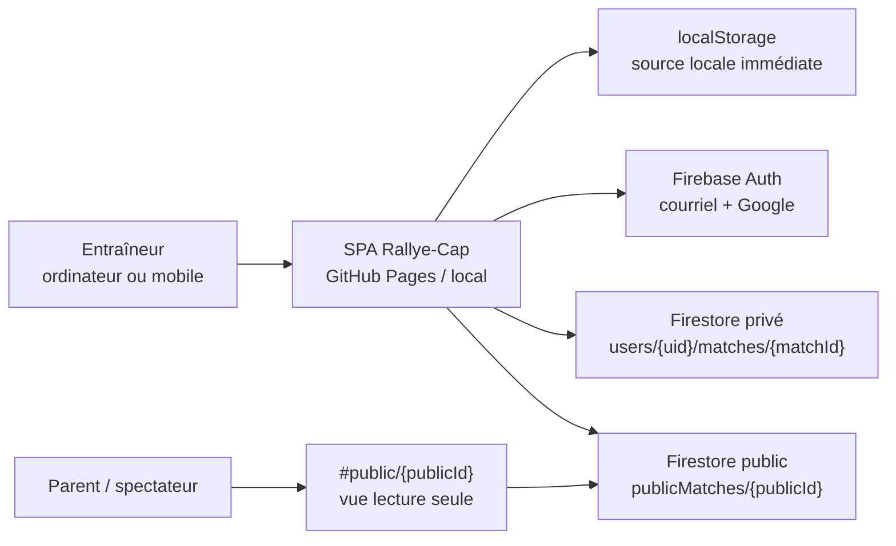
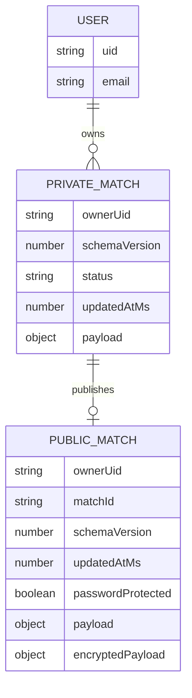
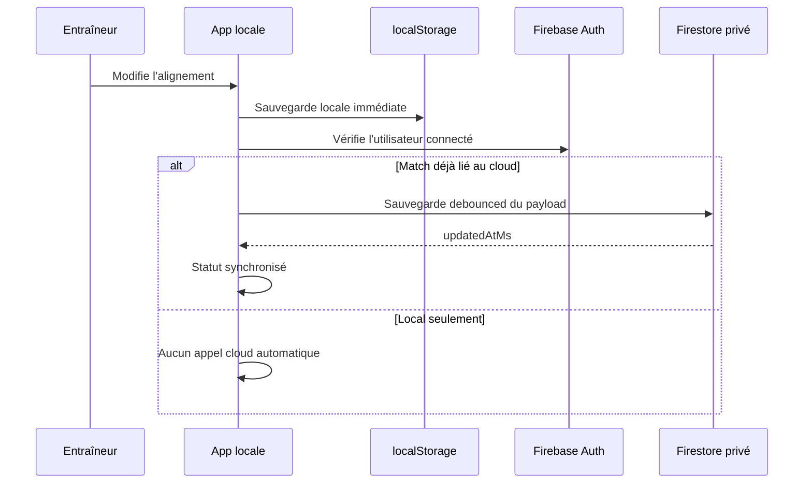
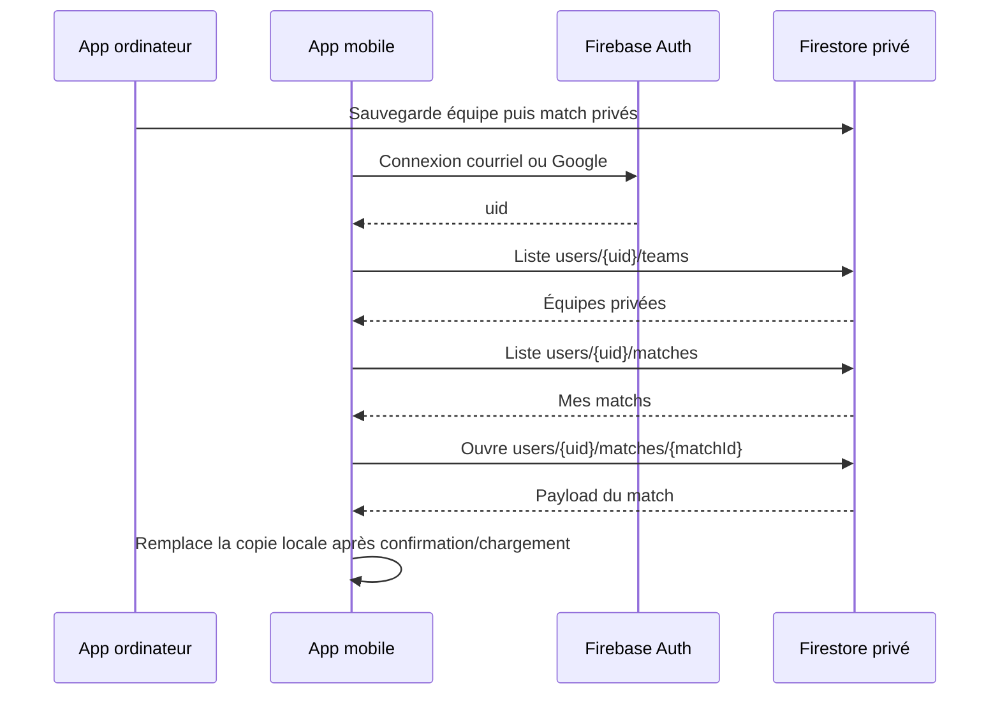
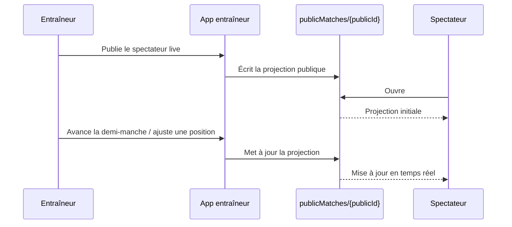
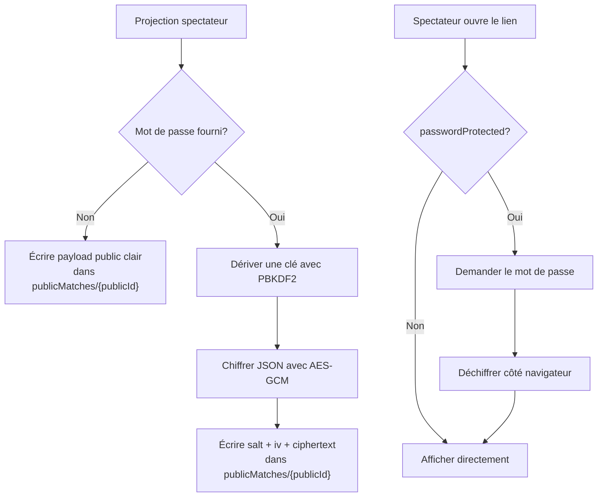
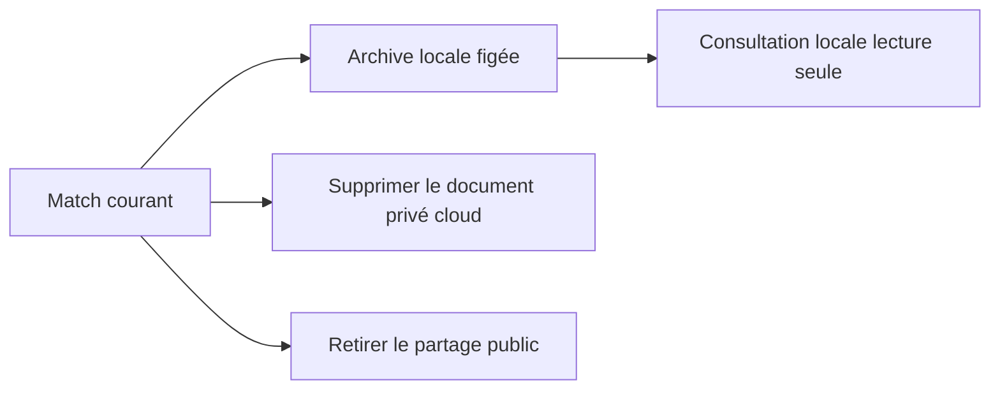
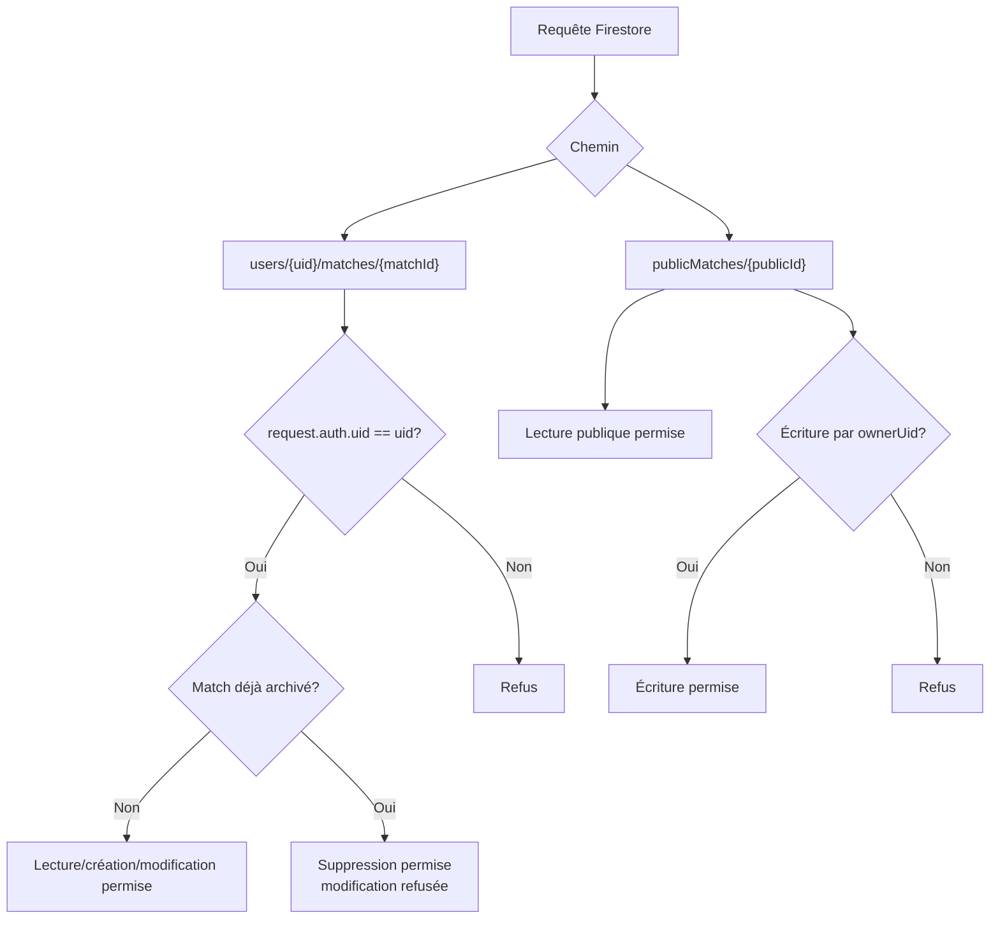

# Firebase / Firestore: synchronisation et partage

Ce document décrit la cible de la première intégration Firebase. L'application reste locale par défaut; Firebase ajoute une sauvegarde optionnelle des matchs mis en ligne, une édition mobile et un mode spectateur public live.

## Vue d'ensemble



Principes:

- `localStorage` demeure la sauvegarde immédiate et hors ligne.
- Firestore synchronise seulement les matchs explicitement mis en ligne.
- Les archives sont des matchs `archived` en lecture seule; elles peuvent rester locales ou exister en ligne, mais ne doivent plus être modifiées.
- Le spectateur public lit une projection limitée, pas l'état complet du match.
- Un mot de passe public optionnel chiffre la projection côté client.

## Modèle Firestore



Chemins:

```text
users/{uid}/teams/{teamId}
users/{uid}/matches/{matchId}
publicMatches/{publicId}
```

L'équipe privée contient son nom, son bassin permanent et ses références publiques non secrètes. Elle possède le même `teamId` sur tous les appareils et doit être gérée en ligne avant qu'un de ses matchs puisse l'être. Les équipes sont chargées avant les matchs lors de la connexion.

Le document privé contient le match complet pour l'édition, incluant `status` au niveau racine et dans `payload.status`. Le document public contient seulement ce que la vue spectateur doit afficher.

## Sauvegarde d'un match



La première sauvegarde en ligne crée ou réutilise `matchId`. Ensuite, les changements locaux peuvent être poussés automatiquement avec un délai court.

## Ouverture sur mobile



En v1, l'entraîneur reprend un match en ligne via `Mes matchs` après connexion. Les rôles multi-entraîneurs ou invitations sont hors portée.

## Spectateur public live



Le spectateur ne peut pas modifier le match. Il reçoit seulement la projection lecture seule.

## Mot de passe public optionnel



Le mot de passe n'est pas stocké dans Firestore. Le chiffrement protège le contenu public si le document est lu directement. Un mot de passe faible reste moins robuste, parce qu'un attaquant pourrait tenter de le deviner hors ligne à partir du contenu chiffré.

## Archivage



Archiver un match le rend figé. Les changements futurs à l'équipe et aux joueurs ne modifient pas l'archive. Si le match archivé existe en ligne, les règles Firestore empêchent ses modifications futures tout en permettant sa suppression.

## Règles de sécurité



Les règles Firestore protègent les documents privés. Un match déjà archivé ne peut plus être modifié côté cloud, mais son propriétaire peut le supprimer. Le chiffrement côté client protège le contenu d'un partage public avec mot de passe.
